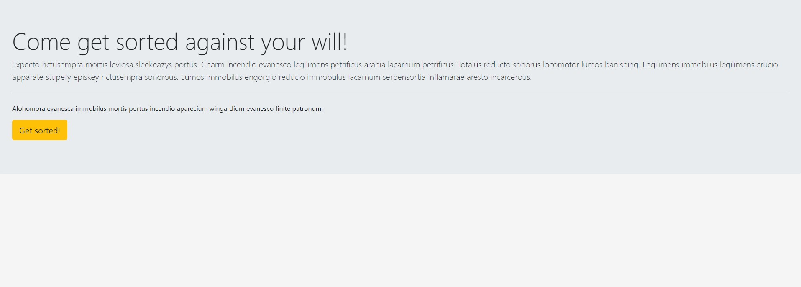
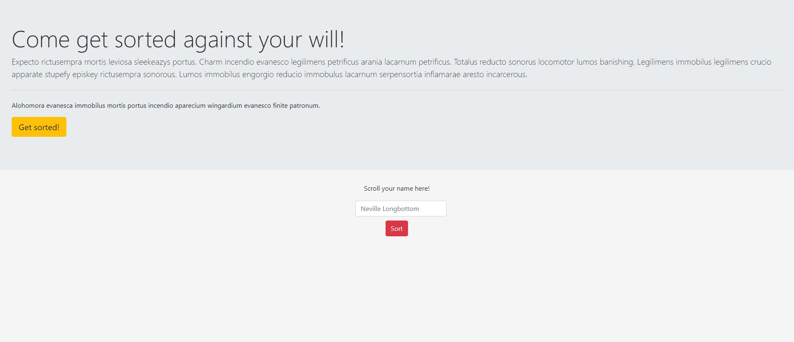
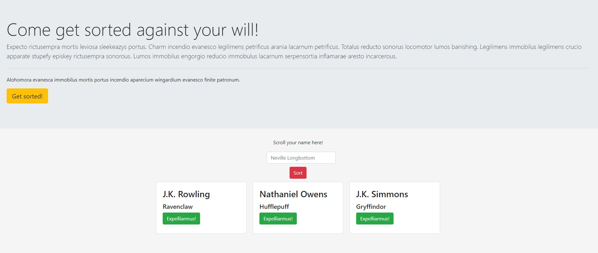

# NSS E12 Exercise - Sorting Hat Site

## Description:
The fourth exercise at NSS. The goal of the exercise was to create a site that sorted viewers using Bootstrap with the print to dom JS. This exercise took what we'd learned from both loops and event listeners to expand our use of logic when using JS. Each card brought about a different event listener, with the last being the expelling of the viewer. 

## Screenshots:
##### Jumbotron Welcome View:

##### Sorting Window w/ Button View:

##### Single Card w/ Button View:

## How To Run:
>1. Clone down this repo.
>1. Install [http-server](https://www.npmjs.com/package/http-server).
>1. Navigate to folder in command line and type `http-server -p 8080`.
>1. Go to `http://localhost:8080` in your browser.